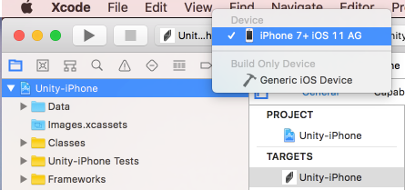
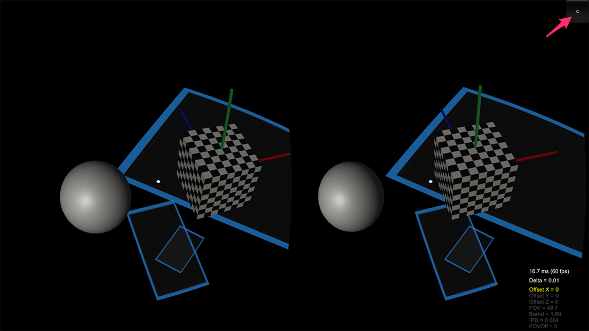

# HoloKitSDK v1.5 (Beta Branch)

HoloKitSDK is the Unity plugins to build AR/MR apps for HoloKit. 

## Features 

## Index

### HoloKit SDK v1.5 (Latest version): 
* For ARKit 1.5 and ARCore preview 2, please checkout "master" branch.

### HoloKit SDK v1.0 (Legacy version):
* For Google Tango, please checkout "tango" branch.
* For Apple iOS (ARKit), please checkout "ios" branch. 
* For Android (ARCore), please checkout "android" branch. 

For detailed manual, please see [HoloKitSDK Reference Manual](docs/MANUAL.md).

## 

## Prerequists(iOS)
* You must be an [Apple Developer](https://developer.apple.com/programs/). 
* An iOS device that supports ARKit and running iOS 11.3.
    * We tested HoloKitSDK with iPhone 7 Plus. 
    * See below for guidance on upgrading to iOS 11.3. 
* Unity 2017.3.1f3 or later. Make sure you installed iOS components.
* [XCode 9.3](https://developer.apple.com/download/). You need to log in to download it with your Apple Developer account. 

## Prerequists(Android)
* An Android device that supports ARCore with Android SDK version 7.0 (API Level 24) or higher.
- Google Pixel and Pixel XL (tested)
- Samsung Galaxy S8
* Unity 2017.3.1f3 or later. Make sure you installed Android components.
* Android Studio with Android SDK installed.
- Prepare your device
  - Enable developer options
  - Enable USB debugging
  - Download the [ARCore Service Preview 2](https://github.com/google-ar/arcore-android-sdk/releases/download/sdk-preview2/arcore-preview2.apk), then install it with the following adb command: 
    adb install -r -d arcore-preview2.apk

## Quick Start(iOS)
1. Import "HoloKitSDK" folder under "Assets" folder into a new Unity project.
2. Open the example scene "HoloKitSDK/Examples/HoloKitSample_Universal".
3. Change the target platform to iOS and click Switch Platform.
4. Open "File" -> "Build Settings" and click "Build". 
Make sure that the paramaters below is correct. Player Settings -> Other Settings
 * Artectecture: ARM64
 * Camera Usage Description: "Blahblah...".
 * Target minimum iOS version: 11.3

5. Choose a location to put the XCode project. After the build is done, open "Unity-iPhone.xcodeproj". Make sure you open it with XCode 9.
6. In Xcode, change your build target to your actual device. 
    * 
6. Click "Unity-iPhone" in the file explorer to see its settings, and select the proper Team. If you don't have any Team listed, go to "XCode" -> "Preferences" -> "Accounts" and add your Apple Developer account. 
    *  
7. Click "Run" to build and launch the example on your device. 
8. After the app runs, you should see a cube and a sphere floating in the air somewhere. You may gaze at the sphere and it'll turn to red. 
    * 
9. The app detects planes, and you may click on the screen to place the cube on the plane. 
    * 
19. You may touch the small "AR/MR" button to switch to HoloKit mode. 
    * 

## Quick Start(Android)
1. Import "HoloKitSDK" folder under "Assets" folder into a new Unity project.
2. Open the example scene "HoloKitSDK/Scenes/HoloKitSample_Universal".
3. Change the target platform to Android and click Switch Platform.
Click Player Settings to open the Android Player Settings. Then change the following settings:

    - Other Settings > Multithreaded Rendering: Off
    - Other Settings > Package Name: a unique app ID that looks like a Java package name, such as com.example.helloAR
    - Other Settings > Minimum API Level: Android 7.0 or higher
    - Other Settings > Target API Level: Android 7.0 or 7.1
    - XR Settings > Tango Supported: On
    
4. Open "File" -> "Build Settings" and click "Build".

## Create your own experience
1. Create a new scene in Unity. 
2. Drag and drop everything in "HoloKitSDK/Prefabs" to the scene, and delete the default "Main Camera" and "Directional Light". 
    * 
3. Put anything you like under "HoloKitPlacementRoot", and your model should have a comparable size as "DebugCube". Then feel free to turn off or delete "DebugCube". 
    * 
4. Build your scene and run!
5. If you don't like the ambient light, please disable HoloKitAmbientLight in your scene.

  
## How to upgrade to iOS 11.3 Beta
1. Backup your device. See "Prepare your device before you update to beta software" section in [About iOS beta software](https://support.apple.com/en-us/HT203282)
2. Follow [iOS beta Software Installation Guide](https://developer.apple.com/support/beta-software/install-ios-beta/) to install iOS 11.3 Beta. Briefly,
  
## Troubleshooting
* I don't have an Apple Developer account. 
    * You need one.
* I cannot see any "Team" in my XCode project settings.
    * Make sure "Automatically manage signing" is checked, and you've logged in with your developer account in "XCode" -> "Preferences" -> "Accounts". 

## Attribution

You shall read the [How to Attribute](https://holokit.io/#develop) section.

App developer shall mark with the words, "Works with HoloKit", or display either of the following two Holokit Logos in your app.

or 

For academic work, please cite Monocular Visual-Inertial State Estimation for Mobile Augmented Reality, P.Li et al (ISMAR 2017, accepted)

 
